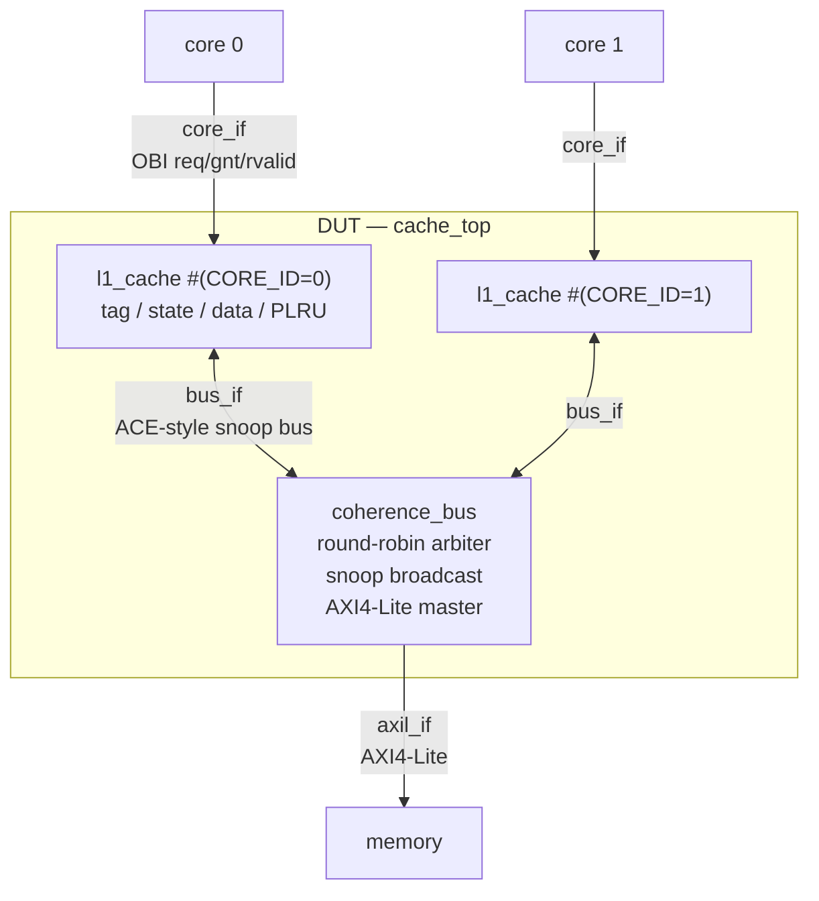
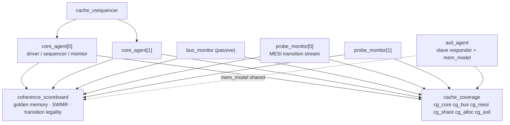

# cachebrayt — MESI-coherent L1 data cache with a UVM verification environment

A two-core, set-associative, write-back L1 data cache that maintains **MESI
coherence** over a snooping interconnect, verified with a constrained-random
**UVM** environment built around coherence invariants rather than
transaction-level golden models alone.

The design is deliberately modest. The verification environment is the point.

---

## Table of contents

- [Why this project](#why-this-project)
- [Architecture](#architecture)
- [Design decisions](#design-decisions)
- [The cache](#the-cache)
- [Coherence protocol](#coherence-protocol)
- [Interfaces](#interfaces)
- [Verification environment](#verification-environment)
- [What gets checked](#what-gets-checked)
- [Functional coverage](#functional-coverage)
- [Assertions](#assertions)
- [Stimulus](#stimulus)
- [Bug injection](#bug-injection)
- [Running it](#running-it)
- [Results](#results)
- [Scope decisions and limitations](#scope-decisions-and-limitations)
- [Repository layout](#repository-layout)

---

## Why this project

Most student cache projects verify a single cache with directed tests: write a
value, read it back, check it. That proves almost nothing, because a single
cache has no interesting failure modes.

The interesting failure modes appear when **two caches disagree about who owns a
line**. Those bugs are invisible to a transaction-level scoreboard that only
watches the core interfaces, because a coherence violation can persist for
thousands of cycles before it produces a wrong load result — and under a
different seed it might never surface at all.

So the environment checks the protocol *directly*:

- a whitebox monitor taps each cache's tag and state arrays
- the scoreboard re-checks the **SWMR invariant**
  (Single-Writer / Multiple-Reader) across both caches every time any line
  changes state
- functional coverage crosses the two caches' states for a line, and the
  combinations MESI forbids are encoded as `illegal_bins`

That last item is the artifact I would point at in an interview. The cross is
not there to be filled — it is there so that any state pair MESI forbids is a
simulation error the moment it occurs.

---

## Architecture



Three protocol boundaries, deliberately three *different* protocols:

| Boundary | Protocol | In one line |
|---|---|---|
| core ↔ L1 | OBI-style `req`/`gnt`/`rvalid` | What a core actually presents to its L1 |
| L1 ↔ L1 | simplified ACE | The only one of the three that *can* carry coherence |
| interconnect ↔ memory | AXI4-Lite | A real standard protocol, where it is cheap and useful |

Each choice is justified in [Design decisions](#design-decisions) below.

---

## Design decisions

Every decision here was a trade-off. The reasoning matters more than the outcome.

The same decisions are marked in the source with a `DECISION:` comment, so
`grep -rn "DECISION:" rtl/ verif/` walks you through them where they actually
live. Everything else is commented at section level only.

### Interfaces

**The core side is OBI-style req/gnt/rvalid, not AXI.**
Real cores do not talk to their L1 over AXI — Ibex and CV32E40P both present a
`req`/`gnt` address phase followed by an `rvalid` response phase, which is what
this interface is. Putting AXI here would add five independent channels, IDs and
burst logic to a boundary that issues one aligned word at a time, buying driver
and monitor complexity with no additional coverage. The one thing it would buy —
"I built an agent for a standard protocol" — is recovered at the memory boundary
for a fraction of the effort.
*Trade-off:* the core agent is bespoke, so it is not reusable outside this
project.

**The coherence bus is a simplified ACE, and it is not AXI4-Lite for a
structural reason.**
AXI4-Lite physically cannot carry coherence. It has no snoop address channel, no
snoop response channel, no snoop data channel, and no way for a master to
declare or be told a cache-line state. It is a single-beat, point-to-point
read/write protocol. Adding coherence to it means inventing sideband signalling,
at which point the protocol is no longer AXI4-Lite and the standard has bought
nothing.

The correct answer in the AMBA family is **ACE**, ARM's coherency extension to
AXI, which adds exactly those channels (AC / CR / CD) and whose transaction set
maps one-to-one onto MESI. So this bus borrows ACE's vocabulary — `ReadShared`,
`ReadUnique`, `CleanUnique`, `WriteBack`, and the `IsShared` / `PassDirty`
response attributes — because using the industry names for the industry concepts
makes the design legible to anyone who knows ACE.

What is simplified: a single atomic shared bus instead of ACE's independent
channels, ordering rules, barriers and distributed virtual memory transactions.
*Trade-off:* this is **ACE-inspired, not ACE-compliant**, and should never be
described as the latter. Full ACE is a multi-week project on its own.

**The memory side is genuine AXI4-Lite.**
This is the one boundary where a standard protocol is both a natural fit and
cheap: a line fill really is a sequence of plain address/data/response
transactions with no coherence content. Making it real AXI4-Lite yields a
reusable slave agent, a full set of protocol assertions worth writing, and a
natural place to inject randomised latency and backpressure that perturbs the
timing relationship between fills and coherence traffic.
*Trade-off:* AXI4-Lite has no bursts, so a line fill is `LINE_WORDS` separate
single-beat transactions rather than one burst. Correct, but not what a real
fill port would do; AXI4 with bursts would be more realistic at the cost of
burst and ID handling that adds no verification value here.

**Why not just use one protocol everywhere.**
Using AXI at all three boundaries would be the cargo-cult answer: wrong at the
core side, impossible at the coherence side, and only correct at the memory
side. Real SoCs use different protocols at different boundaries because the
boundaries have different requirements, and choosing correctly is the skill
being demonstrated.

### Microarchitecture

**The bus is atomic, so MESI has no transient states.**
A grant is held across snoop, memory access and response, so a cache is never
snooped while it owns the bus and every line is in one of the four stable states
at every clock edge. See [Why the bus is atomic](#why-the-bus-is-atomic).
*Trade-off:* a split-transaction bus — the realistic next step — requires the
transient state machine (`IM_AD`, `SM_AD`, …), which is where most genuine MESI
difficulty lives.

**The cache is blocking, with one outstanding miss.**
MSHRs, hit-under-miss and memory-level parallelism would have consumed the whole
schedule and displaced the coherence work, which is the point of the project.
Blocking also keeps the scoreboard's ordering argument tractable: a completing
access always retires before the ownership transfer that follows it.
*Trade-off:* the design has no memory-level parallelism and its performance is
uninteresting. This is a correctness project, not a performance one.

**Invalid ways are preferred over the PLRU victim, lowest index first.**
Allocating into a free way avoids a pointless eviction. Breaking ties by lowest
index rather than arbitrarily keeps victim selection deterministic, which makes
failures reproducible across seeds.
*Trade-off:* it biases which ways fill first, so `cg_alloc` covers free-way and
PLRU-driven victim selection as separate cases to prove both paths run.

**The bus operation is re-derived every cycle rather than latched at request
time.**
This is the only genuine race an atomic bus does not remove, and it is handled
in the RTL rather than assumed away. Details in
[The one race an atomic bus does not remove](#the-one-race-an-atomic-bus-does-not-remove).

**Silent clean eviction is implemented, not avoided.**
Dropping an `S` or `E` line without telling anyone is legal MESI, and it means a
cache can sit in `S` believing a line is shared when it is the only holder. It
would have been easier to notify on every eviction; implementing the
conservative-but-imprecise behaviour is more faithful, and it forces the
reference model to avoid assuming precision.

### Configuration and parameterisation

**Geometry is a verification variable, not a constant.**
`NUM_WAYS`, `NUM_SETS`, `LINE_BYTES` and `NUM_CORES` are all configurable, for
three distinct reasons:

1. *It catches baked-in assumptions.* The same environment has to pass at 2-way
   and 4-way. Anything in the RTL or the checkers that silently assumed two ways
   fails the moment the 4-way build runs.
2. *It makes the PLRU claim honest.* At `NUM_WAYS=2` a tree-PLRU is a single bit,
   which is just LRU. Only at 4 ways is the tree actually a tree. Shipping
   2-way-only and calling it PLRU would not survive the question "how many bits
   per set?"
3. *It lets the default geometry be chosen for verification throughput.* 512
   bytes per cache is absurdly small for a real design, and that is the point:
   under random stimulus over a 4 KB region, conflict misses, evictions and
   writebacks happen constantly instead of rarely.

**Configuration is by `+define+`, not module parameters.**
The geometry has to be visible inside a `package` — the address field widths,
`tag_t` / `index_t` / `line_t`, and the helper functions all depend on it — and
SystemVerilog packages cannot be parameterised. The UVM classes import that same
package, so they need the identical values. Build-time defines with
`` `ifndef `` defaults are the standard way around this.
*Trade-off:* changing geometry needs a recompile, so it cannot be randomised
per-run inside a single build. It is a per-build regression axis instead.

### Verification architecture

**The environment is whitebox on purpose.**
SWMR is a statement about *state*, not about transactions, and it cannot be
checked from the core interfaces at all. A blackbox-only testbench catches a
coherence bug only in the seeds where it happens to surface as a wrong load
result, possibly thousands of cycles after the violation. Tapping the tag and
state arrays turns a latent, seed-dependent bug into an immediate error.
*Trade-off:* the testbench is coupled to RTL internal signal names. Contained by
routing everything through one interface and one generate block in
[verif/tb/tb_top.sv](verif/tb/tb_top.sv), so a rename touches one file.

**The probe is wired with hierarchical assignments rather than `bind`.**
`bind` is the more idiomatic construct, but the target flow was uncertain and
hierarchical references index identically on every simulator. `bind` *is* used
for the assertion modules, where it is both standard and well supported.
*Trade-off:* slightly less elegant; trivially switchable once the flow is known.

**Golden memory is ordered by monitor completion time, with an argument rather
than a mechanism.**
No global-order reconstruction, no timestamping infrastructure. Coherence
already serialises same-address accesses, and the reasoning is written out in
[What gets checked](#what-gets-checked). Building an order-reconstruction engine
would have been more code and more places to be wrong.

**Unwritten memory returns a deterministic hash of its address.**
`mem_model::backing_value()` is used both by the AXI4-Lite slave and to seed the
scoreboard's golden memory, so a load from a location the test never wrote still
has exactly one correct answer. The usual "X on the first read" blind spot
disappears without pre-initialising memory or restricting the address space.

**Coverage is reported by the testbench itself.**
The target flow has no coverage database and no way to merge across runs, so
`final_phase` prints its own table via `get_inst_coverage()`. This is
simulator-independent and survives any flow.
*Trade-off:* no cross-run merging, so the reported number is per-run rather than
cumulative.

**Forbidden protocol states are `illegal_bins`, not uncovered bins.**
An uncovered bin is something you failed to hit. An illegal bin is something the
protocol forbids, and hitting it is an error at the moment it happens. Encoding
the eight forbidden MESI state pairs this way turns the coverage model into a
checker.

**Bugs are injectable by `+define+`.**
Five one-line RTL mutations, each of which must make the regression fail. It is
the cheapest available evidence that the checkers actually check something,
rather than a testbench that passes because it looks at nothing.

---

## The cache

| Parameter | Default | Override |
|---|---|---|
| `NUM_CORES` | 2 | `+define+CFG_NUM_CORES=n` |
| `NUM_SETS` | 16 | `+define+CFG_NUM_SETS=n` |
| `NUM_WAYS` | 2 | `+define+CFG_NUM_WAYS=n` (power of two) |
| `LINE_BYTES` | 16 (4 words) | `+define+CFG_LINE_BYTES=n` |

512 bytes per cache by default — deliberately tiny, so conflict misses and
evictions are common rather than rare. Reasoning in
[Design decisions](#configuration-and-parameterisation).

**Policy:** write-back, write-allocate, blocking (one outstanding miss).

**Replacement:** parameterised **tree-PLRU**, `NUM_WAYS-1` bits per set. Invalid
ways are preferred over the PLRU choice, lowest index first so victim selection
stays deterministic across seeds.

**Control FSM:**

```
IDLE ──req&gnt──► LOOKUP ──┬── hit, load                 ──► RESP
                           ├── hit, store, M/E           ──► RESP   (silent E→M)
                           ├── hit, store, S             ──► BUS    (CleanUnique)
                           └── miss                      ──► WB ──► BUS ──► RESP
```

`WB` issues a `WriteBack` only if the selected victim is still `M`; a snoop may
have downgraded it in the meantime, in which case the state is re-evaluated and
the writeback is skipped.

---

## Coherence protocol

### Local requests

| State | Load | Store |
|---|---|---|
| **I** | `ReadShared` → **S** if `IsShared`, else **E** | `ReadUnique` → **M** |
| **S** | hit, stays **S** | `CleanUnique` → **M** (no data moves) |
| **E** | hit, stays **E** | silent → **M**, no bus transaction |
| **M** | hit, stays **M** | hit, stays **M** |

### Snoop responses

| State | `ReadShared` | `ReadUnique` | `CleanUnique` |
|---|---|---|---|
| **I** | miss | miss | miss |
| **S** | hit, `IsShared`, stays **S** | hit → **I** | hit → **I** |
| **E** | hit, `IsShared` → **S** | hit → **I** | cannot occur (SWMR) |
| **M** | hit, `IsShared`, `PassDirty` → **S** | hit, `PassDirty` → **I** | cannot occur (SWMR) |

A `CleanUnique` is only ever issued by a cache already holding the line in **S**.
By SWMR no other cache can then hold it **E** or **M**, so those table entries
are unreachable — which is why the RTL re-derives its bus operation at grant
time (see below).

### Eviction

| Victim state | Action |
|---|---|
| **I** | free way, no bus traffic |
| **S** / **E** | silent drop, no bus traffic |
| **M** | `WriteBack` to memory, then **I** |

Silent clean eviction is legal MESI and is deliberately implemented: it means
another cache can sit in **S** believing the line is shared when it is in fact
the only holder. The protocol is conservative rather than precise, and the
reference model must not assume otherwise.

### Where dirty data goes

This is MESI, not MOESI, so there is no Owned state and memory must be clean
whenever a line is shared:

- `ReadShared` hitting **M** → the snooper supplies the line **and** the
  interconnect writes it back to memory in the same atomic transaction.
- `ReadUnique` hitting **M** → the dirty line is handed straight to the
  requester, which becomes **M**. Memory is *not* updated; the dirty data simply
  changes owner.

### Why the bus is atomic

The interconnect grants one master at a time and holds that grant across snoop,
memory access and response. A cache is therefore **never snooped while it holds
a grant**, which means every line is in one of the four stable states at every
clock edge — MESI needs no transient states (`IM_AD`, `SM_AD`, …).

This is a scoping decision, not an oversight. The natural next step is a
split-transaction bus, which requires the transient state machine and roughly
triples both the RTL and the verification effort.

### The one race an atomic bus does not remove

A cache can decide it needs the bus, and then be snooped before it is granted:

> Cache 0 holds line X in **S** and requests the bus intending `CleanUnique`.
> Cache 1 wins arbitration first and issues `ReadUnique` on X, invalidating
> cache 0. Cache 0's pending upgrade is now wrong — it no longer has the data.

The RTL handles this by deriving `bus.op` **combinationally from current state
every cycle** rather than latching it at request time. The pending `CleanUnique`
degrades into a `ReadUnique`, and a pending `WriteBack` whose victim was
downgraded simply withdraws its request. A consequence is that `bus.req` may
deassert before it is granted, which is legal on this bus and is checked by
assertion `a_bus_progress` ("grant or retire, but do not hang").

---

## Interfaces

| File | Interface | Notes |
|---|---|---|
| [rtl/core_if.sv](rtl/core_if.sv) | `core_if` | OBI-style. Clocking blocks for driver and monitor. |
| [rtl/bus_if.sv](rtl/bus_if.sv) | `bus_if` | Per-master fields are **unpacked arrays** so each cache drives only its own element; no modports, to avoid false multi-driver errors on a shared packed vector. |
| [rtl/axil_if.sv](rtl/axil_if.sv) | `axil_if` | Full AXI4-Lite, five channels. |
| [rtl/cache_probe_if.sv](rtl/cache_probe_if.sv) | `cache_probe_if` | Whitebox tap, driven by hierarchical assignment from [verif/tb/tb_top.sv](verif/tb/tb_top.sv). |

---

## Verification environment



| Component | Role |
|---|---|
| [core_agent](verif/agents/core_agent/core_agent.sv) | Active OBI master, one per core. Monitor pairs the address phase with the response phase and emits a completed transaction. |
| [axil_agent](verif/agents/axil_agent/axil_agent.sv) | AXI4-Lite **slave** responder backed by [mem_model](verif/agents/axil_agent/mem_model.sv), with randomised per-channel latency. Its monitor feeds coverage; the scoreboard reads the memory model directly at end of test. |
| [bus_monitor](verif/agents/bus_agent/bus_monitor.sv) | Passive. Reconstructs each coherent transaction: op, requester, snoop hits, `PassDirty`, `IsShared`, line data. |
| [probe_monitor](verif/agents/probe_agent/probe_monitor.sv) | Whitebox. Emits one item per observed line-state change, giving a clean MESI transition stream. |
| [coherence_scoreboard](verif/env/coherence_scoreboard.sv) | All checking. |
| [cache_coverage](verif/env/cache_coverage.sv) | All functional coverage, plus a self-printed coverage table. |

### Sampling discipline

Monitors read signals immediately after `@(posedge clk)` rather than through a
clocking block. That is race-free only because the RTL drives those signals from
non-blocking assignments, so the monitor observes pre-edge values. It is a
deliberate choice: `bus_if` carries unpacked arrays, whose support in clocking
blocks varies between simulators.

---

## What gets checked

Six independent mechanisms, chosen so that no single one has to catch everything:

**1. Data-value invariant (golden memory).**
Every store observed at a core interface is applied to a reference memory; every
load is compared against it. Ordering is by monitor completion time. That is
sound because coherence serialises same-address accesses — a core can only write
while it is **M**, and transferring ownership takes several cycles, so a
completing access always retires before the transfer that follows it. Two
same-address accesses completing in the same cycle would itself be an SWMR
violation, which mechanism 3 catches.

**2. MESI transition legality.**
Every state change from the probe stream is checked against a legality table. A
change of *tag* is an allocation, and is legal only if the previous occupant was
clean — so allocating over a modified way (dirty data dropped without a
writeback) is caught immediately rather than thousands of cycles later.

**3. SWMR invariant.**
A per-line census across both caches, re-run whenever any line state changes:
at most one **M**-or-**E** holder, and never an exclusive holder coexisting with
sharers. The sweep is gated on the transition stream rather than run blindly
every cycle, which keeps it cheap.

**4. Sharer data agreement.**
Every cache holding a line in **S** must hold identical data for it.

**5. Bus-level consistency.**
`IsShared` must agree with the observed snoop hits, and an upgrade must never
move data. These check the interconnect's own aggregation logic rather than the
caches.

**6. End-of-test memory reconciliation.**
For every word the test touched, the expected value is compared against the
*actual* system state: the dirty cached copy if some cache still holds the line
**M**, otherwise the AXI4-Lite memory. This is the backstop that catches dirty
data quietly lost anywhere in the run.

---

## Functional coverage

| Covergroup | Covers |
|---|---|
| `cg_core` | op × core × set index × word offset × byte-enable pattern (full word, single byte, partial) |
| `cg_bus` | coherent op × requester × snoop hit × `PassDirty` × `IsShared`; includes dirty intervention, where a snooper supplies data instead of memory |
| `cg_mesi` | old state × new state × tag-changed, per core |
| `cg_share` | **cache 0 state × cache 1 state for one line** |
| `cg_alloc` | victim state at allocation × way × set × core — proves every way gets replaced and that both free-way and PLRU-driven victim selection occur |
| `cg_axil` | AXI4-Lite direction × word position within the line — proves every beat of a line is both fetched and written back |

### The illegal bins

`cg_mesi` and `cg_share` are written so the forbidden cases are `illegal_bins`,
i.e. simulation errors:

```systemverilog
// cg_share — every state pair MESI forbids
illegal_bins mm = binsof(cp_c0) intersect {MESI_M} && binsof(cp_c1) intersect {MESI_M};
illegal_bins ms = binsof(cp_c0) intersect {MESI_M} && binsof(cp_c1) intersect {MESI_S};
illegal_bins ee = binsof(cp_c0) intersect {MESI_E} && binsof(cp_c1) intersect {MESI_E};
// ...

// cg_mesi — allocating over a modified way is dropped dirty data
illegal_bins dirty_dropped = binsof(cp_old)  intersect {MESI_M} &&
                             binsof(cp_tagc) intersect {1};
```

Of the sixteen possible state pairs, only eight are legal: `I` with anything,
`S×S`, and an exclusive owner opposite `I`. The other eight are encoded above.

Unreachable cross bins (same state with no tag change; allocation producing an
invalid line) are excluded with `ignore_bins` so that 100 % is an achievable
target rather than a permanently unreachable one.

### Coverage reporting

There is no tool coverage database in the target flow, so
[cache_coverage.sv](verif/env/cache_coverage.sv) prints its own table from
`final_phase` using `get_inst_coverage()` and `$get_coverage()`:

```
UVM_INFO ... [COV] ---------------- functional coverage ----------------
UVM_INFO ... [COV]   cg_core    ..... %
UVM_INFO ... [COV]   cg_bus     ..... %
UVM_INFO ... [COV]   cg_mesi    ..... %
UVM_INFO ... [COV]   cg_alloc   ..... %
UVM_INFO ... [COV]   cg_axil    ..... %
UVM_INFO ... [COV]   cg_share   ..... %
UVM_INFO ... [COV]   OVERALL    ..... %
```

This is simulator-independent and survives flows that cannot merge UCDBs.

---

## Assertions

| File | Scope | Representative properties |
|---|---|---|
| [verif/sva/cache_sva.sv](verif/sva/cache_sva.sv) | `bind` into every `l1_cache` | OBI request stability and payload stability; exactly one response per accepted request; **`a_grant_excludes_snoop`** — a cache holding a grant is never snooped, which is the assumption the whole no-transient-state argument rests on; `a_op_frozen_while_granted`; `a_bus_progress` |
| [verif/sva/bus_sva.sv](verif/sva/bus_sva.sv) | interconnect | grant and response one-hot-zero; ownership never transfers without an idle cycle; snoop never targets the owner; **`a_single_pass_dirty`** — at most one cache may supply dirty data, because at most one may hold it |
| [verif/sva/axil_sva.sv](verif/sva/axil_sva.sv) | AXI4-Lite | per-channel valid/payload stability until ready, `OKAY` responses, address alignment, no `B` without a preceding `AW` **and** `W`, no `R` without `AR` |

`cache_sva` is attached with `bind`, so the assertions live outside the RTL and
are instantiated per cache automatically.

---

## Stimulus

### Directed vs constrained-random

Eight of the eleven virtual sequences are **constrained-random** and differ only
in how tightly they are constrained — narrowing the address window, fixing the
set, or pinning the load/store mix in order to steer randomisation at a
particular coherence behaviour.

Three are **fully directed**, and they exist for reasons random stimulus cannot
cover:

| Directed sequence | Why it must be directed |
|---|---|
| `mesi_walk_vseq` | Walks every legal same-line MESI transition in a known order on an empty cache. Closes `cg_mesi` **by construction** instead of hoping a seed reaches `M→S`. A failure names the exact transition rather than "somewhere in 80 random accesses". |
| `upgrade_race_vseq` | Deliberately creates the `CleanUnique`→`ReadUnique` degradation — the one race an atomic bus does not remove. Random traffic hits it only by coincidence. |
| `producer_consumer_vseq` | Message-passing litmus test. The ordering claim it checks is meaningless unless the ordering is fixed. |

The directed sequences drive both cores through `do_access()`, which blocks until
`rvalid`, so calling it sequentially gives a strict interleaving between the two
caches. That determinism is the whole point.

### Core-level sequences ([verif/agents/core_agent/core_seq_lib.sv](verif/agents/core_agent/core_seq_lib.sv))

| Sequence | Intent |
|---|---|
| `core_base_seq` | Random ops over a configurable address region, with a `store_pct` weight |
| `core_line_seq` | All traffic inside one line — the false-sharing primitive |
| `core_pingpong_seq` | All traffic to one word |
| `core_set_conflict_seq` | More live tags than ways in a chosen set, forcing evictions and writebacks |
| `core_store_streak_seq` | Repeated stores to one address — silent `E→M` then long runs of `M` hits with no bus traffic at all |
| `core_read_only_seq` | Loads only, so lines settle into `S`/`E` |
| `core_single_seq` | One explicit access, for directed litmus sequences |

### Virtual sequences ([verif/env/seq_lib/cache_vseq_lib.sv](verif/env/seq_lib/cache_vseq_lib.sv))

The base virtual sequence forks one core-level sequence per core; subclasses only
override `run_core_seq()`.

| Virtual sequence | Coherence behaviour it targets |
|---|---|
| `random_vseq` | Broad random traffic |
| `shared_region_vseq` | Both cores confined to four lines — maximum coherence pressure |
| `false_sharing_vseq` | Same line, different words: invalidation storms with no real data sharing |
| `pingpong_vseq` | Same word: ownership migrates on nearly every access |
| `eviction_vseq` | Both cores thrashing the same set |
| `read_mostly_vseq` | Wide `S` sharing that stays stable |
| `store_streak_vseq` | Bursts of stores to one address, then a new one — silent `E→M`, long bus-silent `M` runs, then migration |
| `producer_consumer_vseq` | **Directed.** Message-passing litmus test (below) |
| `mesi_walk_vseq` | **Directed.** Every legal MESI transition, in order, on an empty cache |
| `upgrade_race_vseq` | **Directed.** Simultaneous stores from `S` to force an upgrade to degrade |
| `mixed_vseq` | Chains 3–6 randomly chosen phases in one seed — the regression workhorse |

### Message-passing litmus test

Core 0 writes a payload, then sets a flag **on a different cache line**. Core 1
spins on the flag and, once it observes value *k*, must see payload *k*.

Because the caches are blocking and the bus is atomic, the memory model is
sequentially consistent and the payload can never be stale. The sequence asserts
this explicitly, and the golden-memory checker would independently catch a
violation. It is a small test that makes the consistency claim concrete.

### Tests ([verif/tests/cache_tests.sv](verif/tests/cache_tests.sv))

`smoke_test`, `random_test`, `shared_region_test`, `false_sharing_test`,
`pingpong_test`, `eviction_test`, `read_mostly_test`, `store_streak_test`,
`producer_consumer_test`, `mesi_walk_test`, `upgrade_race_test`,
`regression_test`.

Memory latency is randomised per test through `axil_agent_cfg`, so the timing
relationship between line fills and coherence traffic varies seed to seed rather
than being fixed by the testbench.

---

## Bug injection

Five deliberate RTL bugs sit behind `+define+BUG_n`. Every one of these runs
**must fail** — a clean run means the checkers are blind to that bug and the
environment needs work. This is the cheapest possible evidence that the
testbench actually checks something.

| Define | Injected bug | Expected to be caught by |
|---|---|---|
| `BUG_1` | Snooped **M** line goes to **E** instead of **S** on `ReadShared` | `cg_mesi` illegal bin `m_to_e`, then SWMR |
| `BUG_2` | `CleanUnique` does not invalidate the sharer | SWMR — **M** coexisting with **S** |
| `BUG_3` | Store hit ignores byte enables | Golden-memory load mismatch |
| `BUG_4` | Dirty victim evicted without a writeback | `cg_mesi` illegal bin `dirty_dropped`, plus end-of-test reconciliation |
| `BUG_5` | `ReadShared` always installs **E** | `cg_share` illegal bins, then SWMR |

```bash
make questa TEST=regression_test BUG=2 SEED=7
make bugs   SIM=questa                   # all five
```

---

## Running it

Full tool requirements and the EDA Playground path are in
[docs/SETUP.md](docs/SETUP.md). Short version:

```bash
cd sim
make questa  TEST=regression_test SEED=3
make questa  TEST=eviction_test   WAYS=4        # 4-way build
make regress SIM=questa                         # all tests x 5 seeds
make bugs    SIM=questa                         # bug-injection proof
```

`+num_txns=<n>` shortens any test, which matters on runtime-capped flows.
`+dump` produces a VCD.

Requires a simulator with full UVM 1.2, constrained-random and covergroup
support — Questa, VCS or Xcelium. Verilator and Icarus cannot run this.

---

## Results

> **Not yet populated.** Fill this in after the first clean regression; do not
> ship the README with placeholder numbers.

| Metric | Value |
|---|---|
| Tests × seeds passing | _TBD_ |
| `cg_core` | _TBD_ |
| `cg_bus` | _TBD_ |
| `cg_mesi` | _TBD_ |
| `cg_share` | _TBD_ |
| `cg_alloc` | _TBD_ |
| `cg_axil` | _TBD_ |
| Overall functional coverage | _TBD_ |
| Bug-injection runs detected | _TBD_ / 5 |

Also worth recording once available: which covergroup was hardest to close and
what stimulus change closed it. That story is more interesting than the final
percentage.

---

## Scope decisions and limitations

The *reasoning* is in [Design decisions](#design-decisions). This is the terse
list of what is not built, stated explicitly because knowing what you left out
matters:

- **Atomic bus, so no transient states.** The realistic next step is a
  split-transaction bus, which requires MESI transient states and is where most
  of the genuine protocol difficulty lives.
- **Blocking cache, one outstanding miss.** No MSHRs, no hit-under-miss, no
  memory-level parallelism.
- **Two cores, snooping, no directory.** Snooping does not scale past a handful
  of cores; a directory protocol is the scalable alternative.
- **Data cache only.** No instruction cache, no TLB, no virtual addressing.
- **No cache maintenance operations**, no barriers, no atomics/LR-SC.
- **AXI4-Lite has no bursts**, so a line fill is `LINE_WORDS` separate
  single-beat transactions. Correct, but not what a real fill port would do.
- **No mid-test reset.** Reset is asserted once at time zero; the drivers assume
  it stays deasserted.
- **`cg_share` assumes exactly two cores** and is not constructed otherwise.
- Sequential consistency here is a *consequence* of blocking caches plus an
  atomic bus, not something the design works to provide. A weaker, faster design
  would need a real memory-model argument.

---

## Repository layout

```
cachebrayt/
├── rtl/
│   ├── cache_pkg.sv          parameters, MESI/ACE enums, tree-PLRU functions
│   ├── core_if.sv            OBI-style core interface
│   ├── bus_if.sv             ACE-style coherent bus
│   ├── axil_if.sv            AXI4-Lite
│   ├── cache_probe_if.sv     whitebox tap
│   ├── l1_cache.sv           the cache: FSM, arrays, snoop path
│   ├── coherence_bus.sv      arbiter, snoop broadcast, AXI4-Lite master
│   └── cache_top.sv          two caches + interconnect
├── verif/
│   ├── agents/
│   │   ├── core_agent/       item, cfg, driver, monitor, agent, sequences
│   │   ├── axil_agent/       item, cfg, slave driver, monitor, agent, mem_model
│   │   ├── bus_agent/        item, passive monitor
│   │   └── probe_agent/      item, whitebox monitor
│   ├── env/                  cfg, analysis imps, scoreboard, coverage, vsequencer, env
│   │   └── seq_lib/          virtual sequence library
│   ├── tests/                test library
│   ├── sva/
│   │   ├── cache_sva.sv      bound into every cache
│   │   ├── bus_sva.sv        interconnect properties
│   │   ├── axil_sva.sv       AXI4-Lite protocol
│   │   └── sva_bind.sv       bind statements
│   ├── tb/tb_top.sv          clock, reset, probe wiring, config_db
│   └── cache_uvm_pkg.sv
├── sim/
│   ├── cachebrayt.f          filelist
│   ├── Makefile              questa / vcs / xcelium, regress, bugs
│   ├── tool_check.sv         standalone SystemVerilog capability probe
│   ├── tool_check_uvm.sv     standalone UVM capability probe
│   └── bundle_playground.py  flattens the tree for EDA Playground
└── docs/SETUP.md             tool requirements
```

The `rtl/` + `verif/{agents,env/seq_lib,tests,sva,tb}` split follows the layout
used by OpenHW (CVA6) and lowRISC (OpenTitan, Ibex): reusable agents kept apart
from the block-specific environment, sequences owned by the environment.

Comments are section-level only. Anything marked `DECISION:` is a deliberate
trade-off rather than a description of the code beneath it.
